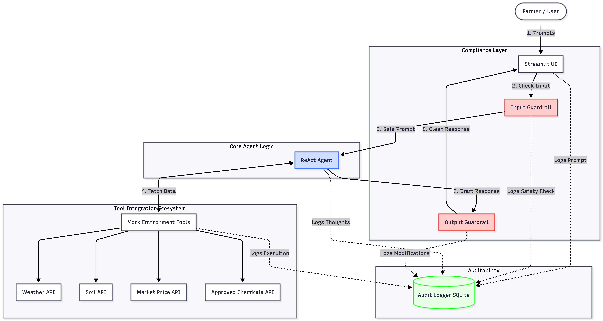

# Agricultural Advisory Agent

## System Overview Overview
The Agricultural Advisory Agent is designed with a strict emphasis on compliance, guardrail enforcement, and auditability. It operates on a ReAct (Reasoning and Acting) framework, intercepted by dedicated policy guards.

## Architecture Diagram

## Component Roles & Communication

### 1. The Compliance Guardrails (Input/Output Interceptors)
- **Role:** Enforces regulatory and domain policies before the LLM processes data or the user sees the output.
- **Communication:** Synchronous interception. If the user asks for restricted chemicals or non-agricultural topics, the `Input Guardrail` blocks the request entirely. If the LLM generates a response containing a locally banned chemical (e.g., DDT), the `Output Guardrail` catches it, modifies the text, appends a legal disclaimer, and passes it to the UI.

### 2. Core ReAct Agent (LangChain)
- **Role:** The reasoning engine. It breaks down complex queries (e.g., "What to plant in region_1 tomorrow?") and decides which tools to invoke.
- **Error Handling logic:** If a tool fails or returns empty data, the ReAct loop catches the parsing error and asks the LLM to rethink or ask the user for clarification.

### 3. Tool Integrations
- **Role:** Simulate external data retrieval (Sensors, Weather Stations, Government Databases).
- **Integration:** The tools are bound as LangChain tools. They are invoked by the Agent dynamically based on the Thought/Action cycle.

### 4. Immutable Audit Logger
- **Role:** Ensures 100% accountability. 
- **Communication:** Receives asynchronous push-events from the UI, Guardrails, Tools, and Agent. It stores JSON payloads of every action to `audit_log.db` to prove compliance to auditors.
